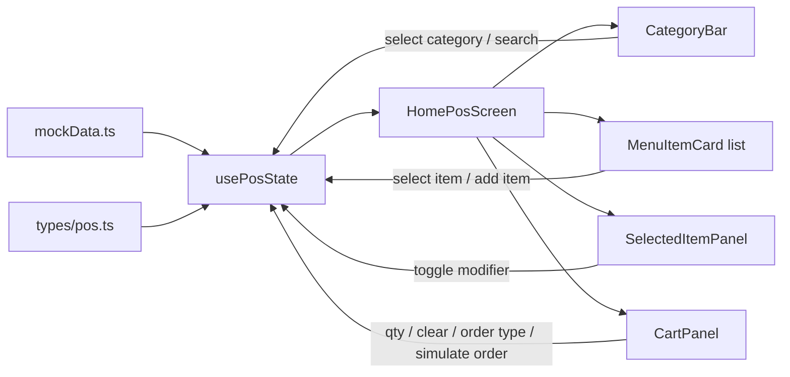

# Home POS Phase 2 Plan

## Goal
Make only the Home POS screen interactive while keeping it frontend-only and visually aligned with the existing design.

## Current Starting Point
The main screen in [c:\Users\arpan\IdeaProjects\nativeDevlopment\kioskable\src\components\pos\HomePosScreen.tsx](c:\Users\arpan\IdeaProjects\nativeDevlopment\kioskable\src\components\pos\HomePosScreen.tsx) still owns hardcoded menu items and renders static child components. The child components already map cleanly to the first interaction layer:
- [c:\Users\arpan\IdeaProjects\nativeDevlopment\kioskable\src\components\pos\CategoryBar.tsx](c:\Users\arpan\IdeaProjects\nativeDevlopment\kioskable\src\components\pos\CategoryBar.tsx): static categories + search placeholder + nav menu
- [c:\Users\arpan\IdeaProjects\nativeDevlopment\kioskable\src\components\pos\MenuItemCard.tsx](c:\Users\arpan\IdeaProjects\nativeDevlopment\kioskable\src\components\pos\MenuItemCard.tsx): visual card only, no selection/add handlers
- [c:\Users\arpan\IdeaProjects\nativeDevlopment\kioskable\src\components\pos\SelectedItemPanel.tsx](c:\Users\arpan\IdeaProjects\nativeDevlopment\kioskable\src\components\pos\SelectedItemPanel.tsx): hardcoded selected item + modifiers
- [c:\Users\arpan\IdeaProjects\nativeDevlopment\kioskable\src\components\pos\CartPanel.tsx](c:\Users\arpan\IdeaProjects\nativeDevlopment\kioskable\src\components\pos\CartPanel.tsx): hardcoded cart rows + totals

## Implementation Approach

### 1. Add shared POS types and mock data
Create small typed frontend-only models for categories, menu items, modifiers, cart rows, and order type state under `src/types/` and `src/lib/`.

Use this to replace the inline screen data currently embedded in `HomePosScreen.tsx` and `CartPanel.tsx` so the screen can derive UI from one local source of truth.

### 2. Introduce a local POS state hook
Create a dedicated hook such as `usePosState()` under `src/hooks/`.

Use:
- `useState` for simple UI state: selected category, selected menu item, selected order type, search text
- `useReducer` for cart and modifier updates: add item, increment, decrement, remove, clear

The hook should expose computed values needed by the UI:
- filtered menu items
- selected item data
- selected modifier state
- cart row data
- subtotal, tax, total
- item count / cart header summary

### 3. Make the top controls interactive
Update `CategoryBar` to become a controlled component instead of owning fixed active state.

Pass in:
- categories
- selected category
- `onSelectCategory`
- search text
- `onSearchChange` if the placeholder is upgraded to a real input in this pass

Keep the three-dot navigation menu behavior intact.

### 4. Make menu cards selectable and addable
Update `MenuItemCard` so each card can:
- show selected styling
- notify the parent when pressed
- add the selected item to the cart through an explicit action

This keeps the card presentational while the hook owns state transitions.

### 5. Drive the selected item panel from real local state
Replace the hardcoded Smash Burger content in `SelectedItemPanel` with props from the selected menu item.

Add controlled modifier toggles so the panel reflects and updates selected modifier state. If no item is selected, show a stable empty state that preserves the layout.

### 6. Drive the cart from reducer state
Convert `CartPanel` from static rows to props-driven rendering.

Wire up:
- order type selection
- clear cart action
- quantity decrement/increment
- removal at zero quantity
- live totals
- simulated place order callback

Keep `Simulate place order` local-only for now; the callback can reset cart state and optionally surface a lightweight success state without touching Orders yet.

### 7. Compose everything in `HomePosScreen`
Keep [c:\Users\arpan\IdeaProjects\nativeDevlopment\kioskable\src\components\pos\HomePosScreen.tsx](c:\Users\arpan\IdeaProjects\nativeDevlopment\kioskable\src\components\pos\HomePosScreen.tsx) as the screen orchestrator:
- call `usePosState()` once
- compute responsive grid rows from filtered items
- pass state and handlers into the existing child components
- preserve the current responsive layout and stacking behavior

### 8. Validate only the Home POS scope
Do not start Orders/Admin/Settings interactivity in this pass.

Validation for this implementation:
- `npx tsc --noEmit`
- lints on touched POS files
- verify the responsive menu grid still works
- verify empty cart / empty selection states do not collapse layout
- verify add/select/quantity/totals/clear flow in the dev build

## Files Likely To Change
- [c:\Users\arpan\IdeaProjects\nativeDevlopment\kioskable\src\components\pos\HomePosScreen.tsx](c:\Users\arpan\IdeaProjects\nativeDevlopment\kioskable\src\components\pos\HomePosScreen.tsx)
- [c:\Users\arpan\IdeaProjects\nativeDevlopment\kioskable\src\components\pos\CategoryBar.tsx](c:\Users\arpan\IdeaProjects\nativeDevlopment\kioskable\src\components\pos\CategoryBar.tsx)
- [c:\Users\arpan\IdeaProjects\nativeDevlopment\kioskable\src\components\pos\MenuItemCard.tsx](c:\Users\arpan\IdeaProjects\nativeDevlopment\kioskable\src\components\pos\MenuItemCard.tsx)
- [c:\Users\arpan\IdeaProjects\nativeDevlopment\kioskable\src\components\pos\SelectedItemPanel.tsx](c:\Users\arpan\IdeaProjects\nativeDevlopment\kioskable\src\components\pos\SelectedItemPanel.tsx)
- [c:\Users\arpan\IdeaProjects\nativeDevlopment\kioskable\src\components\pos\CartPanel.tsx](c:\Users\arpan\IdeaProjects\nativeDevlopment\kioskable\src\components\pos\CartPanel.tsx)

## Files Likely To Add
- [c:\Users\arpan\IdeaProjects\nativeDevlopment\kioskable\src\hooks\usePosState.ts](c:\Users\arpan\IdeaProjects\nativeDevlopment\kioskable\src\hooks\usePosState.ts)
- [c:\Users\arpan\IdeaProjects\nativeDevlopment\kioskable\src\lib\mockData.ts](c:\Users\arpan\IdeaProjects\nativeDevlopment\kioskable\src\lib\mockData.ts)
- [c:\Users\arpan\IdeaProjects\nativeDevlopment\kioskable\src\types\pos.ts](c:\Users\arpan\IdeaProjects\nativeDevlopment\kioskable\src\types\pos.ts)

## Data Flow

## Key Constraints
- Frontend-only, no backend or persistence
- Keep route files thin
- Preserve the current Figma-aligned layout
- Do not broaden scope into Orders/Admin/Settings in this task