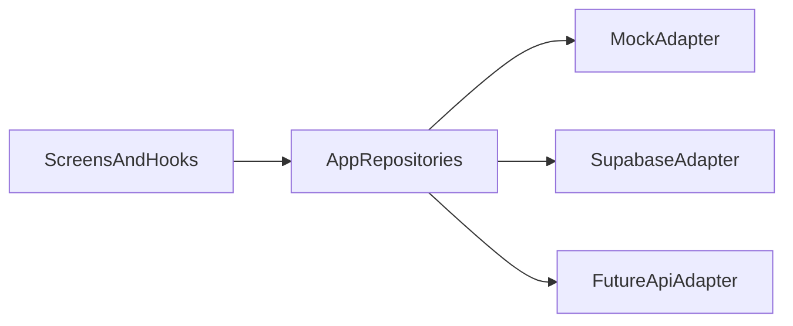

# ServeStation Phase 3 Supabase Readiness Plan

## Goal

Set ServeStation up for a safe move from frontend-only mock data to a real Supabase backend without locking the app too tightly to Supabase-specific shapes. The first backend slice should focus on core product data, not every Phase 4+ concern at once.

## Recommended First Slice

Start Phase 3 with:

- the order model designed first and reviewed carefully
- menu categories
- menu items
- modifier groups / modifier options
- orders and order items

Defer for the first pass:

- payments
- printer integration
- kiosk lock mode
- advanced analytics
- full settings persistence
- full staff auth/roles unless you explicitly want auth in the first backend milestone

## Order Model Comes First

Orders are the highest-risk part of the backend and should be designed more carefully than menu migration or profile/settings persistence.

Menu data is relatively easy to migrate later. Profiles are manageable. Orders are not. Even if Supabase is the first backend, define the order model cleanly from the start so it can support:

- lifecycle state changes
- kitchen workflow status
- multiple timestamps
- payment references
- refunds and adjustment history
- business reporting
- future customer notifications

Before writing Supabase queries, agree on the canonical order shape and lifecycle. This order model should drive the rest of Phase 3 rather than being added casually after catalog reads are working.

## What To Do Before Building

### 1. Normalize the app-owned domain model

Before wiring Supabase into screens, make the frontend depend on app-owned types rather than on current mock-data quirks.

Most important mismatches already visible in the codebase:

- [c:\Users\arpan\IdeaProjects\nativeDevlopment\ServeStation\src\types\pos.ts](c:\Users\arpan\IdeaProjects\nativeDevlopment\ServeStation\src\types\pos.ts)
  - `MenuItem.price` is a `number`
  - `OrderType` is `"Dine-in" | "Pickup" | "Delivery"`
  - modifiers are attached inline to items
- [c:\Users\arpan\IdeaProjects\nativeDevlopment\ServeStation\src\types\orders.ts](c:\Users\arpan\IdeaProjects\nativeDevlopment\ServeStation\src\types\orders.ts)
  - `OrderType` is `"dine-in" | "pickup" | "delivery"`
  - prices/totals/tax are presentation strings instead of raw values
- [c:\Users\arpan\IdeaProjects\nativeDevlopment\ServeStation\src\types\admin.ts](c:\Users\arpan\IdeaProjects\nativeDevlopment\ServeStation\src\types\admin.ts)
  - admin item `price` is a numeric string
  - admin models modifier groups separately from POS modifiers

Before Supabase, unify:

- price/tax/total fields to raw numeric values in shared domain types
- order type values across POS and Orders
- category naming across POS/Admin (`label` vs `name`)
- modifier modeling so Admin and POS point at the same concept

This is the single biggest thing that makes a future Supabase-to-custom-backend migration easier.

### 2. Introduce a backend boundary in the frontend

Right now hooks read mock data directly from `src/lib/mock*` files.

Examples:

- [c:\Users\arpan\IdeaProjects\nativeDevlopment\ServeStation\src\hooks\usePosState.ts](c:\Users\arpan\IdeaProjects\nativeDevlopment\ServeStation\src\hooks\usePosState.ts)
- [c:\Users\arpan\IdeaProjects\nativeDevlopment\ServeStation\src\hooks\useOrdersState.ts](c:\Users\arpan\IdeaProjects\nativeDevlopment\ServeStation\src\hooks\useOrdersState.ts)
- [c:\Users\arpan\IdeaProjects\nativeDevlopment\ServeStation\src\hooks\useAdminState.ts](c:\Users\arpan\IdeaProjects\nativeDevlopment\ServeStation\src\hooks\useAdminState.ts)

Before connecting Supabase, define app-level repository/service modules such as:

- `menuRepository`
- `ordersRepository`
- `adminRepository`
- later: `profileRepository`, `settingsRepository`

The screens/hooks should depend on those modules, not on Supabase directly.

That gives you this migration path:

This is the most important architectural safeguard if you want to start with Supabase now and switch later.

### 3. Decide the initial Supabase schema around product reality, not UI-only fields

Your current frontend already implies backend tables, but some current fields are presentation-oriented and should not be stored exactly as-is.

For Tablecraft, order tables deserve more design attention than catalog tables. Treat catalog migration as straightforward, but treat orders as a long-lived product contract.

Recommended first-table direction:

- `stores`
- `profiles` or `staff_profiles` (only if auth is included early)
- `menu_categories`
- `menu_items`
- `modifier_groups`
- `modifier_options`
- `menu_item_modifier_groups` (join table)
- `orders`
- `order_items`
- optionally `order_item_modifiers`

For `orders`, define the model around raw operational fields rather than UI strings. At minimum, design for:

- stable order ids and human-friendly order numbers
- store id / staff context
- fulfilment type
- lifecycle status and kitchen status
- submitted/accepted/in-progress/ready/completed/cancelled timestamps
- subtotal, tax, discount, refund, and total as raw numeric values
- payment status plus provider/payment reference ids
- cancellation / refund reason fields
- reporting-safe fields that do not depend on UI formatting

For `order_items`, design for:

- referenced item id when available
- snapshot name/price at time of order
- quantity
- modifier selections / modifier price deltas
- note / special instructions

If future customer notifications are likely, leave room for either:

- notification-related timestamps on `orders`, or
- a separate `order_events` / `order_notifications` table later

Important rule: keep UI-derived concepts out of the schema unless intentional.
Examples:

- `popular` should likely stay a product flag or a derived merchandising concept, not a fake category row
- row strings like `"3 items · dine-in · created 2 min ago"` should remain computed in the frontend
- formatted strings like `"$13.50"` should not be stored as the canonical DB value

### 4. Plan auth separately from catalog/orders if you want faster progress

Supabase makes auth easy to add, but auth changes the whole shape of the rollout:

- row-level security
- user/store ownership
- staff roles
- session handling in the app

If your immediate goal is to get real data flowing, start with:

- public/dev-safe catalog reads
- authenticated admin mutations later

That lets you validate product data flow before taking on permissions.

### 5. Decide what stays local in Phase 3 even after backend begins

Not everything must move to Supabase immediately.

Good candidates to keep local at first:

- cart in-progress state
- selected modifier UI state
- UI theme preview state
- temporary action feedback strings

Good candidates to move first:

- categories
- menu items
- modifiers
- submitted orders
- admin menu edits

This keeps Phase 3 manageable and avoids overconnecting the UI too early.

## Recommended File/Folder Direction

Keep the current frontend shape, but add a backend-aware layer.

Suggested additions:

- `src/domain/` or continue using `src/types/` for normalized app-owned entities
- `src/repositories/`
  - `menuRepository.ts`
  - `ordersRepository.ts`
  - `adminRepository.ts`
- `src/lib/supabase/`
  - `client.ts`
  - adapter/query modules later
- `src/mappers/` (optional)
  - DB row -> app model
  - app model -> mutation payload

Keep route files thin and keep Supabase out of screen components.

## Frontend Cleanup To Do First

Before binding screens to Supabase, clean these areas:

- [c:\Users\arpan\IdeaProjects\nativeDevlopment\ServeStation\src\types\pos.ts](c:\Users\arpan\IdeaProjects\nativeDevlopment\ServeStation\src\types\pos.ts)
- [c:\Users\arpan\IdeaProjects\nativeDevlopment\ServeStation\src\types\orders.ts](c:\Users\arpan\IdeaProjects\nativeDevlopment\ServeStation\src\types\orders.ts)
- [c:\Users\arpan\IdeaProjects\nativeDevlopment\ServeStation\src\types\admin.ts](c:\Users\arpan\IdeaProjects\nativeDevlopment\ServeStation\src\types\admin.ts)
- [c:\Users\arpan\IdeaProjects\nativeDevlopment\ServeStation\src\lib\mockData.ts](c:\Users\arpan\IdeaProjects\nativeDevlopment\ServeStation\src\lib\mockData.ts)
- [c:\Users\arpan\IdeaProjects\nativeDevlopment\ServeStation\src\lib\mockOrderData.ts](c:\Users\arpan\IdeaProjects\nativeDevlopment\ServeStation\src\lib\mockOrderData.ts)
- [c:\Users\arpan\IdeaProjects\nativeDevlopment\ServeStation\src\lib\mockAdminData.ts](c:\Users\arpan\IdeaProjects\nativeDevlopment\ServeStation\src\lib\mockAdminData.ts)

Priority cleanup list:

- unify money fields to numeric values
- unify order type enums
- create one canonical menu item shape used by POS/Admin/Orders
- split presentation helpers from canonical data

## Proposed Phase 3 Sequence

### Step 1. Backend-readiness refactor

- normalize shared domain models
- create repository interfaces
- keep existing mock adapters working through the same repository API

### Step 2. Supabase foundation

- add Supabase client setup
- create project environments and env var strategy
- define the initial schema for orders first, then catalog
- create migrations / SQL setup approach

### Step 3. Catalog integration

- move category/item/modifier reads from mock data to Supabase-backed repository methods
- keep cart/order submission local until reads are stable

### Step 4. Order write integration

- submit orders into Supabase
- update Orders list/detail to read real order data

### Step 5. Admin mutations

- wire admin item edits and add-item flow to Supabase mutations
- add permissions/auth when needed

## Validation Checklist Before Backend Coding

Confirm these are settled first:

- one canonical app-owned domain model for catalog + orders
- one repository boundary between UI and data source
- one decision on whether auth is in the first slice or delayed
- one initial schema for orders first, then menu
- one env/config approach for local development vs production

## Notes

- Supabase is a good Phase 3 choice for speed, but do not let the screens call Supabase directly.
- If you follow the repository/adapter pattern, switching later to a custom Node backend becomes much easier.
- The safest first production slice is still `menu + orders`, but the order model should be designed and reviewed before catalog migration work starts.

