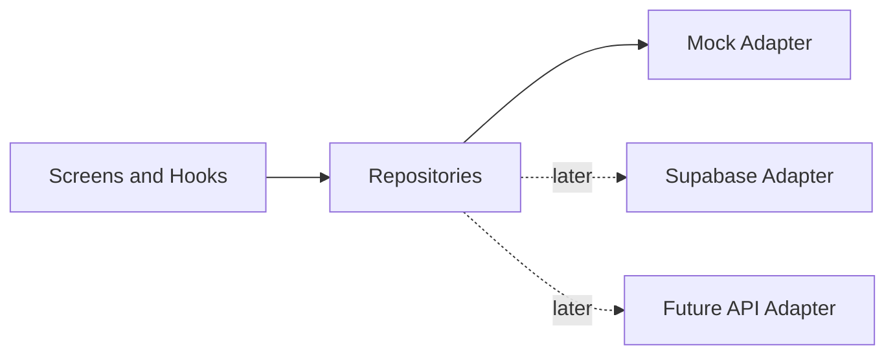

# Phase 3 — Supabase Rollout

This is the execution guide for moving ServeStation from frontend-only mock data
to a Supabase backend, without letting the UI depend on Supabase-specific shapes.
It reflects the readiness work already landed in the codebase and sequences the
remaining backend milestones.

The guiding rule: **the order model is designed first and drives everything.**
Catalog migration is comparatively easy; orders carry operational state,
timestamps, and reporting, so they were modeled up front. The order contract is
now **reviewed and locked** — see [order-lifecycle.md](./order-lifecycle.md) for
the authoritative state machine, timestamps, snapshot rules, and what is
deliberately deferred (payments, refunds, notifications).

## What's already in place (readiness landed)

- **Canonical domain model** — `src/domain/`
  - `money.ts` — numeric `Money` + `formatMoney`/`parseMoney`/`roundMoney`
  - `fulfilment.ts` — one `FulfilmentType` (`dine_in`/`pickup`/`delivery`) plus
    converters from the two legacy casings
  - `menu.ts` — `MenuCategory`, `MenuItem`, `ModifierGroup`, `ModifierOption`,
    `Catalog`
  - `orders.ts` — the reviewed `Order` aggregate: a single `OrderStatus`
    (`submitted → preparing → ready → completed`, plus `cancelled`), numeric
    `OrderMoney` (`total = subtotal + tax - discount`), milestone
    `OrderTimestamps`, snapshotted `OrderItem`/`OrderItemModifier`, and pure
    lifecycle helpers (`createSubmittedOrder`, `transitionOrder`, `cancelOrder`).
    Payments/refunds are deferred (no fields on the order).
- **Mapping layer** — `src/mappers/`
  - normalizes the per-screen view/mock shapes into the canonical model
    (POS `label`→`name`, admin string prices → numeric, order UI strings →
    numeric money + canonical states)
- **Repository boundary** — `src/repositories/`
  - `types.ts` — `MenuRepository`, `OrdersRepository`, `AdminRepository`
  - `adapters/mock/*` — mock adapters implementing those interfaces
  - `index.ts` — the `menuRepository` / `ordersRepository` / `adminRepository`
    singletons the app imports
- **Boundary enforced** — hooks (`usePosState`, `useOrdersState`,
  `useAdminState`) and screens read only through the repositories. The only
  files that still touch `src/lib/mock*` are the mock adapters.
- **Initial schema** — `supabase/migrations/0001_init.sql`
  - orders / order_items / order_item_modifiers defined first, then the catalog
    tables, with cross-table foreign keys attached last

## Rollout sequence

### Step 0 — Order model review (DONE — contract locked)
- Reviewed `src/domain/orders.ts` and the `orders` section of
  `supabase/migrations/0001_init.sql` together and reconciled them.
- Locked a single status machine, milestone timestamps, money invariant, and
  guarded transitions (code `transitionOrder` + SQL
  `apply_order_status_transition`); deferred payments/refunds to later phases.
- The contract, allowed/rejected transitions, and acceptance tests are captured
  in [order-lifecycle.md](./order-lifecycle.md). Treat changes as expensive.

### Step 1 — Supabase foundation
- Create the Supabase project (dev + prod) and run `0001_init.sql`.
- Add `src/lib/supabase/client.ts` reading `EXPO_PUBLIC_SUPABASE_URL` and
  `EXPO_PUBLIC_SUPABASE_ANON_KEY` from env (do not commit secrets).
- Add `@supabase/supabase-js` as a dependency at this step (not before).

### Step 2 — Catalog reads
- Implement a Supabase menu adapter behind `MenuRepository`.
- Swap `menuRepository` in `src/repositories/index.ts` (or select by env).
- Map DB rows → canonical `Catalog` → view types using the existing mappers.
- Keep cart / order submission local until reads are stable.

### Step 3 — Order writes
- The `OrdersRepository` write contract is already defined (`createOrder`,
  `transitionOrder`, `cancelOrder`, active/history queue reads); implement the
  Supabase adapter against it — `transitionOrder`/`cancelOrder` should call the
  `apply_order_status_transition` RPC, never raw `UPDATE`s.
- Persist submitted orders; read the Orders list/detail from Supabase.
- Update the POS `placeOrder` flow to call `ordersRepository.createOrder(...)`
  (build `OrderCreateInput` from the cart) instead of only resetting local state.

### Step 4 — Admin mutations
- Back `AdminRepository` edits (field updates, add item, publish, stock) with
  Supabase writes.
- Introduce auth + Row Level Security here (store-scoped policies, `staff_id`
  FK, session handling), since mutations are the point that needs permissions.

## Stays local in Phase 3 (even after the backend begins)

- in-progress cart state and selected-modifier UI state (`usePosState`)
- theme preview state (`UiSettingsScreen`)
- transient action-feedback strings (order detail, admin)

## Moves to Supabase (in order)

1. menu categories, items, modifiers (catalog reads)
2. submitted orders (order writes)
3. admin menu edits (mutations, with auth/RLS)

## Guardrails

- Screens/hooks must keep importing from `@/repositories`, never from
  `@/lib/mock*` or `@/lib/supabase/*` directly.
- Money stays numeric end-to-end; formatting happens only at render via
  `@/domain/money`.
- Never store UI-derived text (`"$13.50"`, `"2 min ago"`) as canonical data.
- Adding a `FutureApiAdapter` (custom Node backend) later only means writing new
  adapters against the same repository interfaces.
